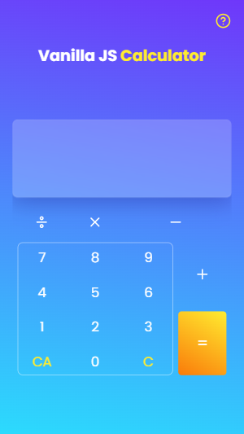

# Vanilla JS Calculator 🧮

## About the project 🎯

This is a simple calculator created with __Vanilla JavaScript__ after two mounths of learning of the leanguage. It was a real challange to find the best aproach to build its algorithm´s logic, but with some knowlodge of the JS tools I could develop it

 - Suports all basic operations: sum, subtraction, multiplication, division.
 - [Based on app-ideas repository´s calculator project](https://github.com/florinpop17/app-ideas/blob/master/Projects/1-Beginner/Calculator-App.md)
 - [Live Site Here!](https://henriquepinheiro12.github.io/VanillaJS-Calculator/)

## Screenshots 📷

## What I learned ✔️

- [X] Working with array functions (map, reduce, splice, join...)
- [X] Working with string functions (substr, slicem split)
- [X] on click animations with JS
- [X] layouts with CSS Grid

## What I intend to leran yet💡

- [X] RegExp

## New features soon 🌠

- [] '+' or '-' to change the sign of a number
- [] Decimal numbers '.'
- [] Parentheses in the expressions

## Author 🧑‍💻

- Frontend Mentor - [@HenriquePinheiro12](https://www.frontendmentor.io/profile/HenriquePinheiro12)
- Github - [@HenriquePinheiroo12](https://github.com/henriquepinheiro12/)
- Linkedin - [@Henrique Pinheiro](https://www.linkedin.com/in/henrique-pinheiro-a43b62203/)
